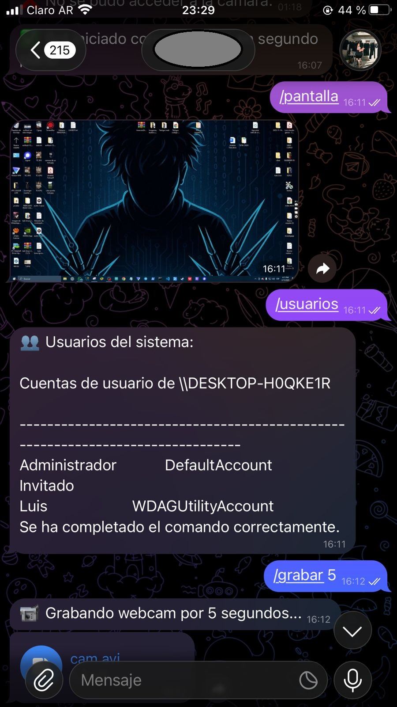
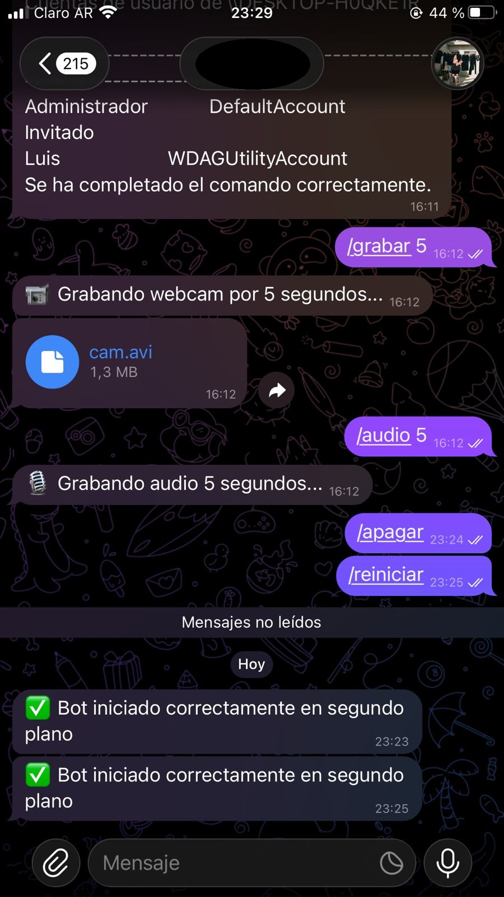

# 🤖 TeleBot PC — Control Remoto de tu PC desde Telegram

> Bot de Telegram que permite controlar tu propia PC de forma remota — capturas de pantalla, webcam, comandos, audio y más. Pensado para administración personal y concientización sobre seguridad.

[](https://python.org)
[](https://core.telegram.org/bots)
[](https://microsoft.com/windows)

---

## ⚠️ Aviso de Seguridad

Este proyecto demuestra el poder y el **riesgo** de los bots de control remoto. Úsalo **únicamente en tu propia PC y con tu propio bot de Telegram**. Instalarlo en equipos ajenos sin autorización es **ilegal**. El autor no se responsabiliza por usos indebidos.

> 💡 **Dato importante para concientización:** Un dispositivo BadUSB podría instalar este tipo de herramienta en segundos en una PC desatendida. Por eso nunca dejés tu PC desbloqueada ni conectés USBs desconocidos.

---

## ✨ Comandos disponibles

| Comando | Descripción |
|---|---|
| `/start` | Verificar conexión con el bot |
| `/pantalla` | Captura de pantalla en tiempo real |
| `/camara` | Foto desde la webcam |
| `/pantalla_video [seg]` | Graba la pantalla N segundos |
| `/grabar [seg]` | Graba video desde la webcam |
| `/audio [seg]` | Graba audio del micrófono |
| `/cmd [comando]` | Ejecuta un comando en CMD |
| `/ip` | Muestra la IP del equipo |
| `/programas` | Lista los programas instalados |
| `/usuarios` | Lista los usuarios del sistema |
| `/mensaje [texto]` | Muestra un popup en pantalla |
| `/apagar` | Apaga el equipo |
| `/reiniciar` | Reinicia el equipo |

---

## ⚙️ Instalación

### 1. Requisitos
```bash
pip install pytelegrambotapi opencv-python pyautogui pillow numpy sounddevice scipy
```

### 2. Crear tu bot en Telegram
1. Abrí Telegram y buscá **@BotFather**
2. Escribí `/newbot` y seguí los pasos
3. Copiá el **TOKEN** que te da BotFather
4. Para obtener tu **CHAT_ID** escribile a **@userinfobot**

### 3. Configurar credenciales
Editá el archivo `LuisBotPC.py` y reemplazá:
```python
TOKEN = os.getenv("TELEGRAM_TOKEN", "TU_TOKEN_AQUI")
CHAT_ID = int(os.getenv("TELEGRAM_CHAT_ID", "TU_CHAT_ID_AQUI"))
```
Con tus datos reales. **Nunca subas el token a GitHub.**

### 4. Ejecutar
```bash
python LuisBotPC.py
```

---

## 🚀 Arranque automático con Windows

Para que el bot arranque solo cuando encendés la PC:

1. Presioná `Win + R` y escribí `shell:startup`
2. En esa carpeta creá un archivo `TeleBot.bat` con este contenido:
```batch
@echo off
pythonw "C:\ruta\completa\LuisBotPC.py"
```
3. Listo — la próxima vez que enciendas la PC el bot arranca solo en segundo plano.

> Usá `pythonw` en vez de `python` para que no aparezca la ventana de CMD.

---

## 🛠️ Stack técnico

| Tecnología | Uso |
|---|---|
| **Python** | Lenguaje principal |
| **pyTelegramBotAPI** | Conexión con Telegram |
| **OpenCV** | Captura de webcam y video |
| **PyAutoGUI** | Capturas de pantalla |
| **sounddevice / scipy** | Grabación de audio |

---

## 🔐 Seguridad del bot

El bot tiene autorización por **CHAT_ID** — solo el dueño puede controlarlo:
```python
def autorizado(message):
    if message.chat.id != CHAT_ID:
        bot.send_message(message.chat.id, "⛔ No tenés permiso.")
        return False
    return True
```
Si alguien más encuentra tu bot, no puede hacer nada.

---

## 📸 Screenshots




---

## 👤 Autor

**Luis García** — [@LuisGarcia-InfoSec](https://www.linkedin.com/in/luis-garc%C3%ADa-8138762b6/)  
Analista de Ciberseguridad & Forense Digital · Buenos Aires, Argentina  
🌐 [proyects-luis.netlify.app](https://proyects-luis.netlify.app)

---

*Proyecto desarrollado para uso personal y concientización en seguridad.*
